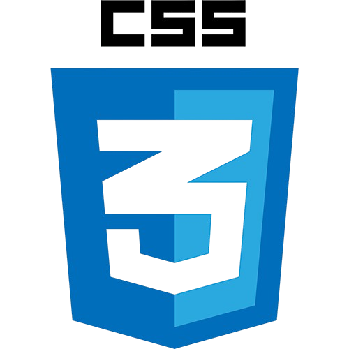
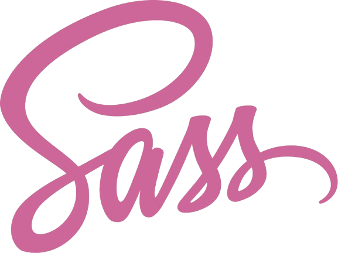
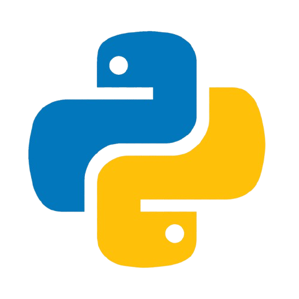
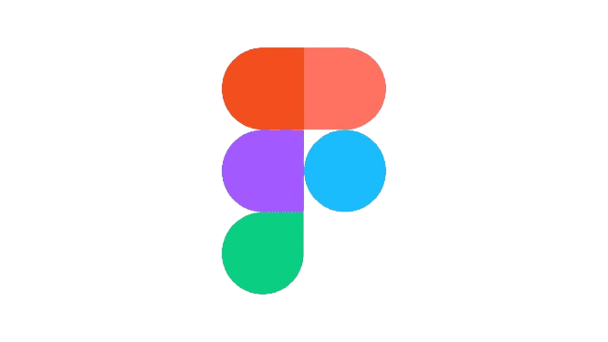

# 🌸 Bem-vindo ao meu GitHub! 🌸

  <!-- Imagem de boas-vindas -->
  

## 🚀 Sobre Mim

  <!-- Animação do seu nome -->
  <h2>
    
    

        
    

     
  </h2>

   🚀 Desenvolvedora apaixonada por tecnologia e criatividade! Busco transformar ideias em realidade, transformar a vida das pessoas ao meu redor através da tecnologia, explorando linguagens, frameworks e           design. Amo estudar e compartilhar conhecimento e ter oportunidade de contribuir com projetos inovadores.

  🎓 Formação Acadêmica: 

  Estudante de Sistema de Informação - UNASP - 3/8 🤩

  Certificação Técnica em Analise e Desenvolvimento de Sistema - ETEC Hortolândia 😎

  Estudante do Curso Tecnico de Desenvolvimento de Sistemas - SENAI - 2/3 🤓

---

## 💻 Tecnologias que Utilizo
Aqui estão algumas das tecnologias que amo trabalhar:

  
  
  
  
  
  
  
  
  
  
  
  

---

## 🌟 Destaque!
### 🐍 Jogo da Cobrinha dos Commits  

<picture>
  <source media="(prefers-color-scheme: dark)" srcset="dist/github-snake-dark.svg" />
  <source media="(prefers-color-scheme: light)" srcset="dist/github-snake.svg" />
  
</picture>

---

## 📞 Contato
Me encontre nas redes:  

      

🌸 **Obrigada por visitar meu perfil!** 🌸
